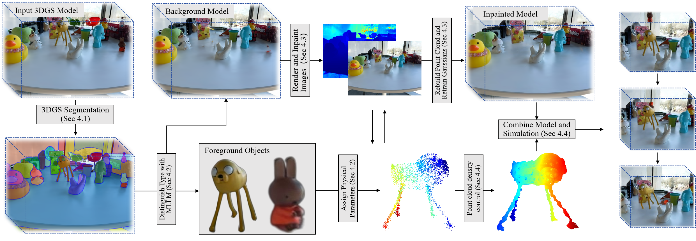

# PhySimGS: Object-Level Multi-Material Physical Simulation in 3D Gaussian Splatting
### [[Projcet Page](https://PhySimGS.github.io)]    [[arXiv]()]     [[Video](https://youtu.be/YTgVACy8eF0?si=wfGpbrnA9xrFaAqe)]

Ji Zhiyang, Lian Zhouhui

Wangxuan Institute of Computer Technology (WICT), Peking University

Abstract:*Realistic dynamic simulation of 3D objects is essential for delivering truly immersive interactive experiences. Recent advances in 3D Gaussian Splatting (3DGS) have opened up new possibilities for synthesizing lifelike object dynamics from dense point clouds. However, integrating physics-based simulation into 3DGS pipelines poses two critical challenges: how to select appropriate simulation parameters and how to define precise simulation domains. Prior work has attempted to predict elastic parameters in simple, single-object scenes, but these approaches neither automate the delineation of foreground and background nor support multi-object, multi-material settings in open environments, limiting their practical value.*

*In this paper, we introduce <strong>PhySimGS</strong>, a novel framework that unifies automatic foreground-background separation, background inpainting, and scene understanding to enable per-object, multi-material dynamic generation in unconstrained scenes. Specifically, our method first segments the scene into distinct object and background regions, then assigns material properties automatically. A dedicated background inpainting module is applied to repair artifacts and fill holes, producing seamless backdrops for simulation. Thus, the proposed PhySimGS delivers fully automated, photo-realistic, multi-material dynamics within the 3DGS environment. We verify the versatility of PhySimGS across various complex scenes involving multiple objects and materials. To our knowledge, this is the first system to achieve per-object, multi-material physical simulation in 3DGS, while significantly enhancing background fidelity and greatly reducing setup complexity. Extensive experiments on a single consumer-grade GPU (RTX 4070 Super) show that PhySimGS produces more realistic dynamics than other state-of-the-art methods, demonstrating its great potential in real applications of 3D dynamic generation.*